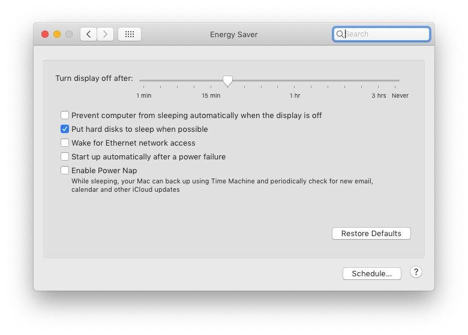
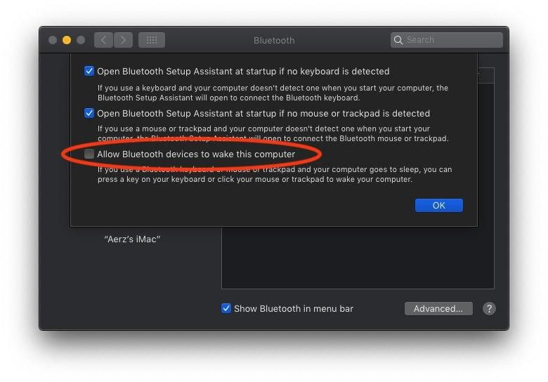

# GA-Z270-Gaming K3 - OpenCore

This repository contains my personal EFI folder that I've used for my Hackintosh build. The purpose is to share how I accomplished the installation, tools, resources and so on.

## Build

|         Hardware      |                   Model                                                                                                                               |
|----------------------:|:------------------------------------------------------------------------------------------------------------------------------------------------------|
|           Motherboard | [Gigabyte Z270 Gaming K3](https://www.gigabyte.com/Motherboard/GA-Z270-Gaming-K3-rev-10#kf)                                                           |
|           CPU | [Intel i7-7700](https://ark.intel.com/content/www/us/en/ark/products/97128/intel-core-i7-7700-processor-8m-cache-up-to-4-20-ghz.html)                         |
|           GPU | [AMD Sapphire Radeon HD 7870 GHz Edition 2 GB (Dual-X)](https://pcpartpicker.com/product/CxphP6/sapphire-video-card-100354oc2l)                               |
|           Hard disk | [Samsung SSD 970 EVO NVMe M.2 500 GB](https://www.samsung.com/us/computing/memory-storage/solid-state-drives/ssd-970-evo-nvme-m2-500gb-mz-v7e500bw/)    |
|           RAM | [Corsair VENGEANCE LPX 3000Mhz (8GB x 2)](https://www.corsair.com/us/en/Categories/Products/Memory/VENGEANCE-LPX/p/CMK16GX4M2B3000C15)                        |
|           Wireless + Bluetooth | [BCM94360 + WTXUP PCI-E X1 X4 X8 X16](https://es.aliexpress.com/item/32870443308.html)                                                       |
|           Alternative Wireless Dongle | [TP-Link TL-WN725N](https://www.tp-link.com/us/home-networking/usb-adapter/tl-wn725n/)                                                |
|           Power Supply | [Corsair TXM Series TX550M](https://www.corsair.com/us/en/Categories/Products/Power-Supply-Units/txm-series-2017-config/p/CP-9020133-NA)             |

## What's working?

- ✅ macOS BigSur 11.0
- ✅ Audio
- ✅ Hardware acceleration (dGPU + iGPU)
- ✅ Sleep and Wake
- ✅ USB-C + USB 3.0
- ❓ Firevault. Not tested

## How to use?

### BIOS

I use the following settings, check all of them before use the EFI folder:

```
- MIT
    - Advanced Frecuency Settings -> Extreme Memory Profile (XMP): Profile1
    - Advanced Memory Seetings ->
        - Extreme Memory Profile (XMP): Profile1
        - Memory Frecuency (MHz): 3000Mhz
    - Miscellaneous Settings -> 3DMark01 Enhancement: Disabled

- BIOS
    - Fast boot: Disabled
    - Windows 8/10 Features: OtherOS
    - LAN PXE Boot Option ROM: Disabled
    - Storage Boot Option Control: UEFI
    - Other PCI devices: UEFI

- Peripherals
    - Initial Display Output: PCIe 1 Slot
    - USB 3.0 DAC-UP 2: Normal
    - USB Configuration -> XHCI Hand-Off: Enabled
    - SATA and RST Configuration -> Agressive LPM Support: Disabled (Enable can cause graphical freezes)

- Chipset
    - VT-d: Disabled
    - Internal graphics: Enabled
    - DVMT Pre-Allocated: 64MB
    - DVMT Total Gfx-Mem: 128MB
```

## Troubleshooting

### Sleep/Wake

To avoid random wake-up calls you have to disable:

1. `Settings > Energy Saver > Enable Power Nap`



2. `Settings > Bluetooth > Advanced > Allow Bluetooth devices to wake this computer`



Also, if sleep/wake doesn't work properly, you can debug the "wake reason" from the terminal:

```shell
sudo pmset -g
pmset -g assertions
log show --style syslog | fgrep "Wake reason"
```

### HiDPI

This tools helped me to configure easily HiDPI displays:

- [one-key-hidpi](https://github.com/xzhih/one-key-hidpi) - Allows to enable macOS HiDPI resolutions on any 2K-4K display
- [RDM](https://github.com/avibrazil/RDM) - Allows to set the right retina resolution

### USB Patch

In this build, I don't use any USB patch (which changes in every new macOS update/release) instead, I did a custom kext that contains all the USB ports fixed. I followed this steps:

- Remove `USBPorts.kext` and remove its load on `config.plist`
- Apply the USB Patch Limit that match with your macOS installation
- Download and use [Hackintool](https://github.com/headkaze/Hackintool), go to USB tab and click on the help incon `(?)`
- Follow the instructions and generate a new `USBPorts.kext`
- Remove the USB Patch Limit, paste the new kext on the Kexts folder and load it in `config.plist` array.

More guides about USB Patch:

- [Why should you USB map](https://dortania.github.io/OpenCore-Post-Install/usb/#macos-and-the-15-port-limit)
- [Guide Native USB Fix for Notebooks - No Injector/Kext Required](https://www.olarila.com/topic/6878-guide-native-usb-fix-for-notebooks-no-injectorkext-required/)
- [Why you need to care about USB mapping](https://aplus.rs/2020/usb-mapping-why/)
- [How-to: USB mapping for OpenCore](https://aplus.rs/2020/usb-mapping-how/)


### When dual-boot can not set the proper time on Windows 10

This is a common problem, so to fix it you should run `scripts/timefix/Windows Universal Time - On.reg`. Just double click on it from Windows and the system date will be persistent.

To disable, use the `scripts/timefix/Windows Universal Time - Off.reg` file.

## Resources

- [Dortania - Hackintosh Guides](https://dortania.github.io/)
- [r/hackintosh](https://www.reddit.com/r/hackintosh/)
- [Getting Started with OpenCore](https://insanelymacdiscord.github.io/Getting-Started-With-OpenCore/)
- [OpenCore Vanilla Guide, Step by Step](https://www.olarila.com/topic/8918-opencore-vanilla-guide-step-by-step-full-dsdt-patched-or-ssdt/)
- [Hackintosh Installer University](https://github.com/huangyz0918/Hackintosh-Installer-University)
- [Hackintosh long-term maintenance model EFI and installation tutorial](https://github.com/daliansky/Hackintosh/blob/master/README_en.md)
- [OpenCore Hot Patching guide](https://github.com/jsassu20/OpenCore-HotPatching-Guide)

## Credits

- [mald0n](https://www.olarila.com/profile/2-mald0n/): Thanks for DSDT Patch
